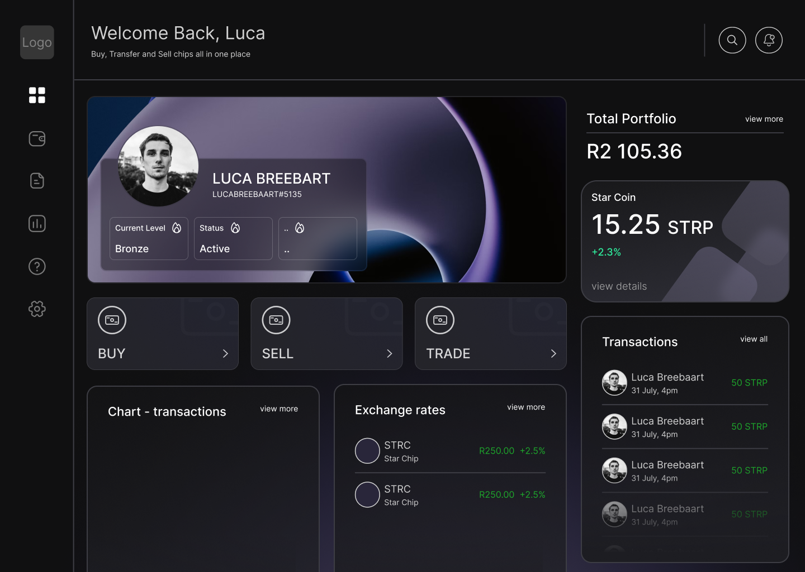
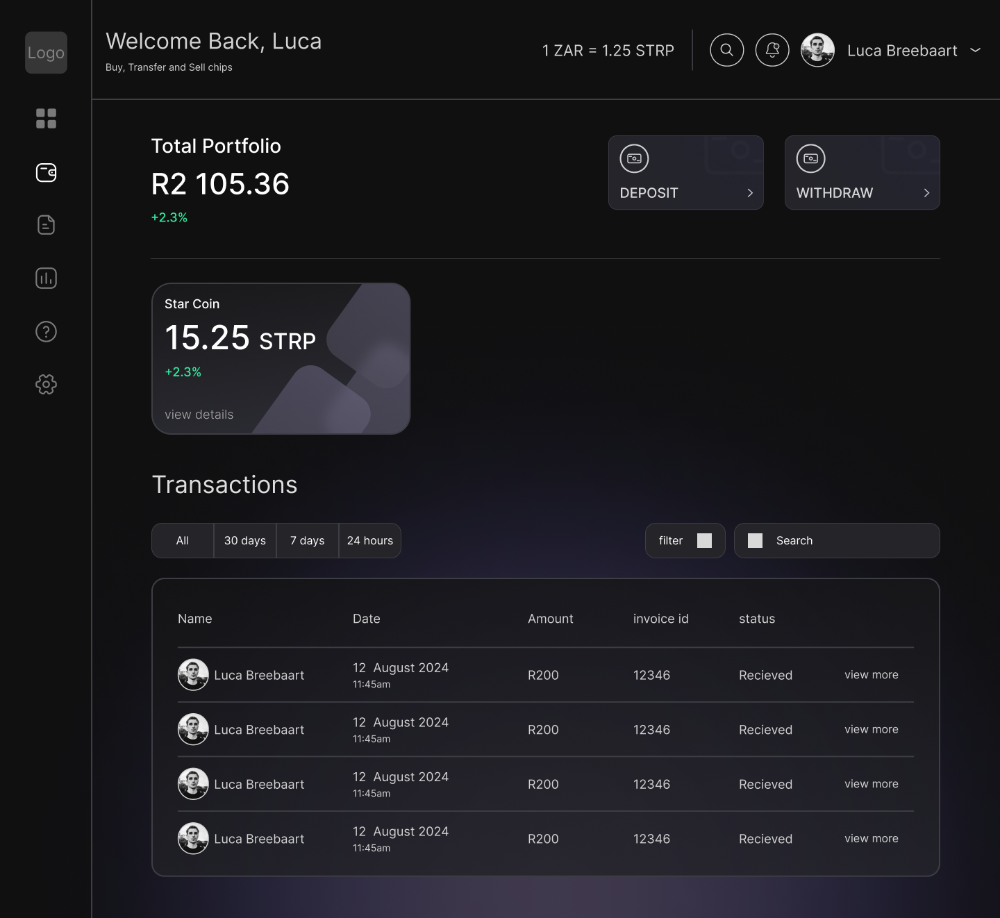
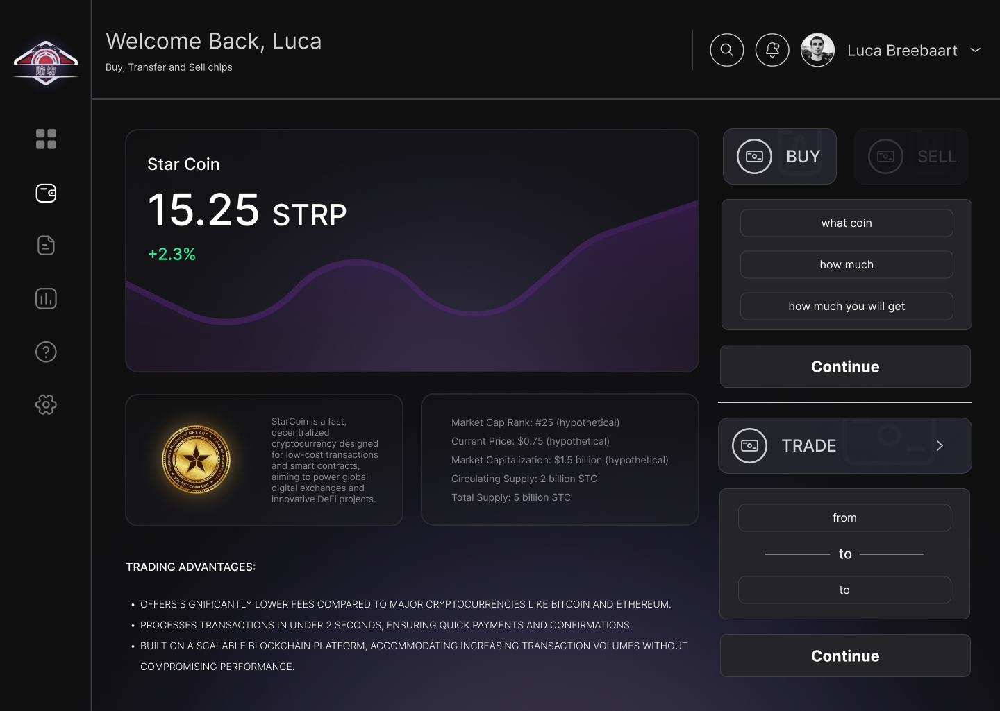
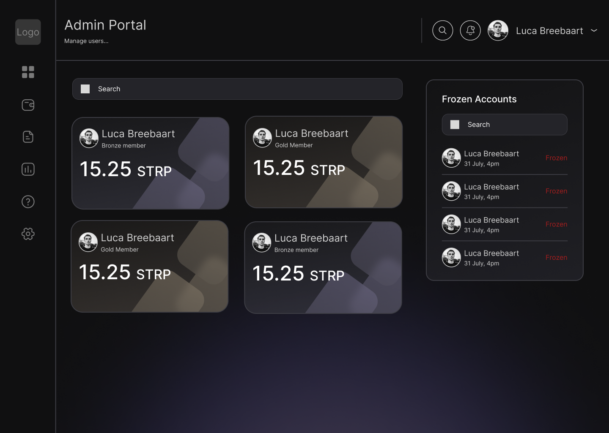
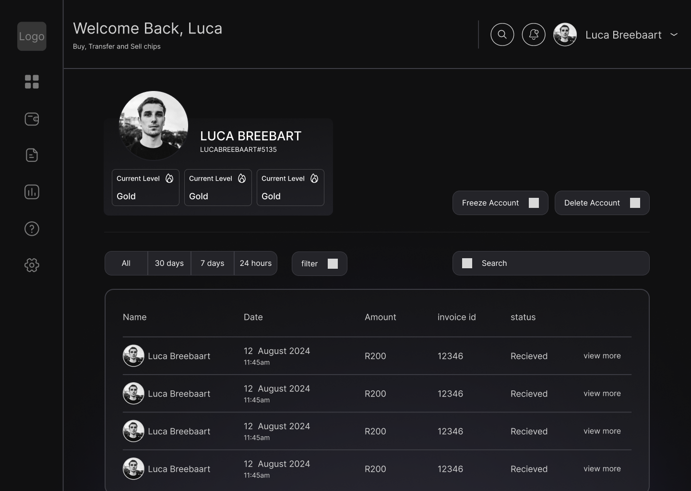

## 
Mareli Lourens, Nico van Wyk, Luca Breebaart, CS Strijdom  221119, 221179, 221345, 21100249   Interactive Development 300 - Term 3

  

## 
Cross-Platform Desktop Development

## Table of Contents

* [About the Project](#about-the-project)
  * [Product mockup](#product-mockup)
  * [Project description](#project-description)
  * [Built With](#built-with)
* [Getting Started](#getting-started)
  * [Prerequisites](#prerequisites)
* [Features and Functionality](#features-and-functionality)
* [Concept Process](#concept-process)
   * [Ideation](#ideation)
   * [Wireframes](#wireframes)
* [Development Process](#development-process)
    * [Highlights](#highlights)
    * [Challenges](#challenges)
* [Future Implementation](#future-implementation)
* [Final Outcome](#final-outcome)
* [Conclusion](#conclusion)
* [Contact](#contact)

## About the project:

### Product mockup:

### Project description:
We developed a cross-platform desktop application that simulated an e-banking system. The project allowed account holders to manage their finances, including purchasing specific currencies, making transactions with other account holders, and withdrawing funds. A particularly intriguing aspect of this endeavor was the administrative functionalities, where an admin user could manage accounts, view transactions, and perform actions such as freezing accounts. The project placed a strong emphasis on secure authentication practices, including 2-factor authentication, and incorporated data summaries and visualizations to provide insights into user activity.

### Built with:

* <a>C#</a>
* <a href="https://www.axios.com/">Axios</a>
* <a href="https://react.dev/">React</a>
* <a href="https://www.electronjs.org/">Electron</a>

## Getting Started:

### Prerequisites:

* [NPM](https://www.npmjs.com/)

## Features and Functionality:

The web application is organized into six key user-facing pages, each with specific functionalities. The landing page features an introductory video and the company logo, leading users to the authentication page. Here, users can register with their email, username, and password, secured with 2-factor authentication via email OTP. After successful login, users access their account overview, displaying their balance, recent transactions, and visual summaries of activities. If accounts are frozen, users are notified and restricted from viewing details.

On the purchasing currency page, users can buy currencies at displayed exchange rates, with their balance updated accordingly. The transactions and withdrawals page allows users to transfer funds and withdraw money, with transaction histories shown. Admins have a dedicated portal to view account details, freeze accounts, and review transaction histories, without making transactions on behalf of users.

## Concept Process:

### Ideation:

During the initial brainstorming phase of the project, we explored similar websites where companies manage their stock and drew inspiration from gambling games with crafting systems. These sources served as our primary influences, and we incorporated elements we found appealing into our wireframe designs. Once the wireframes were finalized, we proceeded with the initial codebase setup and backend configuration.

### Wireframes:

## Development Process

### Highlights

We found the experience of working on this project to be immensely rewarding. One of the key highlights us was learning how to work as a team to complete a website that is fully functional and deployment ready.

Overall, I feel that this project was an incredibly valuable learning experience for us. Not only did it allow us to expand our skill sets and gain a deeper understanding of key concepts and techniques, but it also gave us the opportunity to work on a real-world project with practical applications as a group. We look forward to building on what we've learned and continuing to grow and develop as programmers and developers in the future.

### Challenges

Throughout this project, we faced several challenges that pushed us beyond our comfort zones. One of the most significant hurdles was deciding when to migrate the database, which often required recreating data due to a single change. Despite these difficulties, the project proved to be an invaluable learning experience. Navigating the complexities of database management expanded our developer capabilities and honed our problem-solving skills. On the positive side, we enjoyed the efficiency of generating controllers with simple commands, which saved time and allowed for immediate integration. Looking back, we feel a strong sense of accomplishment and are eager to apply these lessons to future projects.

## Future Implementation

Reflecting on our work on this project, there are several areas where we feel there is room for improvement and further development. One of the key areas where we would like to focus in the future is on stabilizing the code and improving consistency. While we were able to get the code working effectively for the purposes of this project, we feel that there is room for improvement in terms of streamlining the code, making it more efficient, and reducing redundancies. In addition, we would like to develop a more consistent coding style when it comes to working in a group, to make the code more accessible to others and easier to maintain over time.

Another area where we would like to expand and enhance the project is in making it more interactive and engaging for users. While the website is functional and provides a useful service, we believe that there is room to add more interactivity and animation to the site, in order to make it more visually appealing and engaging for users. This might involve developing new features and functionalities, such as interactive maps or dynamic data visualizations, or adding subtle animations and effects to various elements of the site.

## Final Outcome

## Conclusion

This project has been an incredible learning experience for us, and we are truly grateful for the opportunity to work on it. Throughout the course of the project, we have learned so much, from technical skills to project management and collaboration.

Working on this project has allowed us to put into practice many of the concepts and techniques we have learned in our studies, and it has also challenged us to expand our knowledge and skills. From developing the initial idea to designing and implementing the project, we have gained a deeper understanding of the software development process and the importance of effective communication and teamwork.

We am particularly proud of the progress we have made in developing our programming skills. We have also gained a greater appreciation for the importance of testing and debugging, and how these skills are critical to developing high-quality software.

Overall, this project has been an incredibly fulfilling experience, and we are eager to continue working on it and implementing new features and improvements in the future. We believe that this project has not only helped us to develop our technical skills, but has also given us valuable experience working in a team environment and managing a project from start to finish. We am excited to take these skills and experiences with me as we move forward in our career, and we am confident that they will serve us well in whatever challenges lie ahead.

## Authors
Mareli Lourens - [Find me on Github](https://github.com/MareliLourens) 
Nico van Wyk - [Find me on Github](https://github.com/Pantonym) 
Luca Breebaart - [Find me on Github](https://github.com/LucaBreebaart) 
CS Strijdom - [Find me on Github](https://github.com/DanteCS25)

## Contact
Mareli Lourens - [Email](mailto:221119@virtualwindow.co.za) 
Nico van Wyk - [Email](mailto:221179@virtualwindow.co.za) 
Luca Breebaart - [Email](mailto:221345@virtualwindow.co.za) 
CS Strijdom - [Email](mailto:21100249@virtualwindow.co.za)

## Project Link
Frontend - https://github.com/MareliLourens/Du_Fang  
Frontend - https://github.com/Pantonym/Du_Fang_Backend

